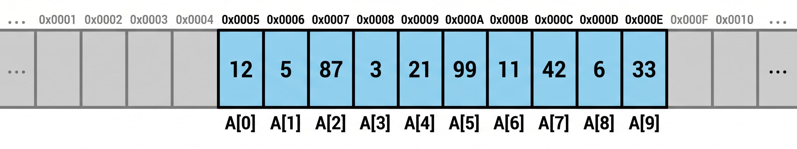

Тезисно:

1. Ошибок бояться не надо
2. Лучше пайтон выбросит ошибку, чем выдаст неправильный ответ
3. топ ошибок
4. ошибки читать снизу вверх

---
import {PythonEditor} from '../../components/PythonEditor.tsx'

## Ошибки...
Что вы чувствуете, когда запустив программу, увидели, что она выдала ошибку? Скорее всего это злость и непонимание. Очень хочется поскорее избавиться от нее и получить ответ. Но ошибки — наши лучше друзья. Ведь именно они защищают ваши баллы.

Думаю, самая частая ошибка в программировании — выход за пределы массива. Index out of bounce exception видел каждый программист и не раз. Это очень частая ошибка. И к слову, это самая лучшая ошибка, которую можно получить в программе. Потому что она предотвращает непредвиденное поведение программы.

## Exception vs Runtime Exception
В программировании существует несколько видов ошибок. Первый — ошибки компиляции, они же синтаксические ошибки. Когда вы забыли закрыть скобку, не поставили двоеточии или не поставили отступ. Это самые безобидные ошибки, которые очень быстро и легко фиксятся.

<PythonEditor
  client:only="react"
  initialCode={`def my_func()
    print('hello world'!)`}
/>

Второй — ошибки во время выполнения, заметить их уже сложнее. Причем, чем сложнее программа, тем сложнее их обнаружить.

<PythonEditor
  client:only="react"
  initialCode={`nums = [1, 5, 6, 90, 67, 69, 552, 228]
for i in range(len(nums)):
    x1 = nums[i]
    x2 = nums[i + 1]
    print(f"{x1} / {x2} = {x1 / x2}")`}
/>

Такой код спокойно запуститься, в нем никаких синтаксических ошибок нету. Но во время выполнения вы получите exception (обычно так называют ошибки, которые вылетают в программе) о делении на ноль. Чаще всего, программисты работают именно со вторым видом ошибок, потому что их сложнее всего предсказать до выполнения программы. (Для этого вообще профессия отдельная есть, QA-тестер)

Попробую объяснить, почему выбрасывание исключений (ошибки времени выполнения) хорошие и полезны для вашей программы. Возьмем в качестве примера внутреннее устройства массива.Это просто выделенный кусок оперативной памяти фиксированного размера. К примеру возьмем список 10 чисел типа `int` .



Схематичное устройство оперативной памяти, разделенной на ячейки. Где-то мы выделили 10 ячеек. Наши данные, которые мы сохранили в массив, лежат в конкретном месте в памяти. По адресам с 0x005 до 0x00E (в оперативной памяти адреса имеют 16-ричный формат записи). Что будет, если мы обратимся к массиву по индексу 15? Мы получим доступ к памяти, которая нам не принадлежит. Зачастую, там будет лежат мусор. Можете проверить это, скачав C++, создать массив на 10 элементов и попробовать вывести значение массива по индексу 11. Ошибки у вас никакой не будет, просто выведится какое-то мусорное значение. Но иногда, вместо мусора это может быть важная информация. Пароли, строки подключения к базам данных, возможность использовать вредосный код. (Можете почитать в интеренет про уязвимость в протоколе, который не проверял сколько данных ему надо отправить обратно и мог отправить кусок своей оперативной памяти где лежала очень важная информация).

На первый взгляд, это кажется мелочью. Ну что такого, я то точно никогда не допущу такую ошибку. Ну, допустите. В программах посложнее hello world очень редко удается удержать все возможные сценарии в голове. Поэтому когда программа вылетает с ошибкой `Index out of range exception` это спасение от непредвиденных последствий.

Представим ситуацию, вы на экзамене пишите задание номер 17. Вы забыли написать - 1 в `range` и получили вот такой код

```python
for i in range(len(nums)):
	x1 = nums[i]
	x2 = nums[i + 1]
```

Ваша программа обратилась к памяти, которая ей не принадлежит. Вам “повезло”, программа не вылетала, в `x2` записалось мусорное значение, каким-то чудом `if` выполнился и у вас получился ответ на 1 больше. И такие сценарии будут происходить во всех программах. Ни одной ошибки не выбрасывается. Вы получаете 28 баллов за экзамен, потому что почти все задачи решены не правильно.

Вот если бы excptions выбрасились бы, вы бы обратили внимание на неправльно написанную строку и исправили ошибку. Поэтому ошибки надо любить. Они вам подсказывают, чтобы вы исправили свой же написанный код. Они выбрасываются не из-за вредности, они пытаются вам помочь.

## Учимся читать exception
